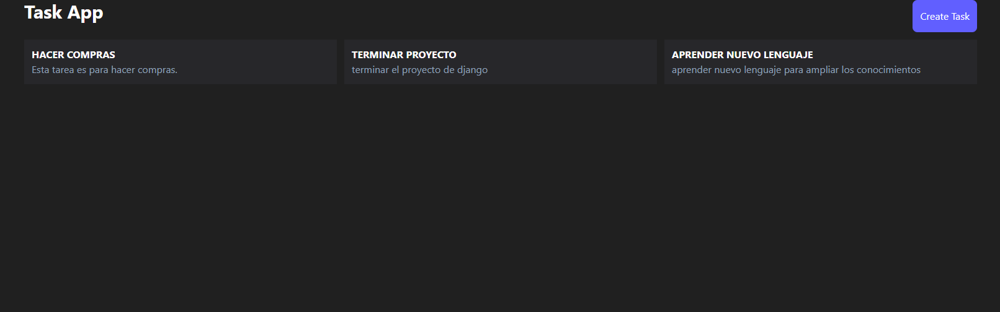
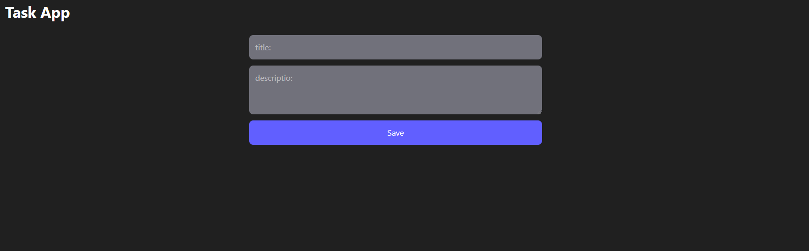

# Task Manager App




Aplicación completa de gestión de tareas (CRUD) construida con Django REST Framework en el backend y React con Vite en el frontend.

## 🚀 Tecnologías

**Backend:**
- Django 5.x
- Django REST Framework
- SQLite (desarrollo)

**Frontend:**
- React 18
- Vite
- Tailwind CSS
- React Router DOM
- Axios
- React Hook Form
- React Hot Toast

## 📦 Instalación

### Requisitos previos
- Python 3.10+
- Node.js 18+
- Git

### Clonar repositorio
```bash
git clone https://github.com/j-paezalbarracin/task-manager.git
cd task-manager
```

## 🔗 Endpoints de la API

| Método | URL | Descripción |
|--------|-----|-------------|
| GET | `/api/v1/tasks/` | Listar todas las tareas |
| POST | `/api/v1/tasks/` | Crear nueva tarea |
| GET | `/api/v1/tasks/{id}/` | Obtener una tarea |
| PUT | `/api/v1/tasks/{id}/` | Actualizar tarea |
| DELETE | `/api/v1/tasks/{id}/` | Eliminar tarea |


### Configurar backend
```bash
python -m venv venv
venv\Scripts\activate
pip install -r requirements.txt
python manage.py migrate
python manage.py runserver
```

### Configurar frontend
```bash
# En otra terminal, entrar a la carpeta client
cd client

# Instalar dependencias
npm install

# Iniciar React
npm run dev
```